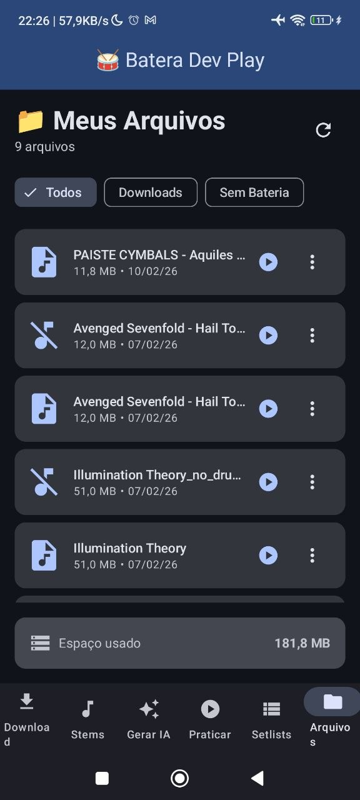
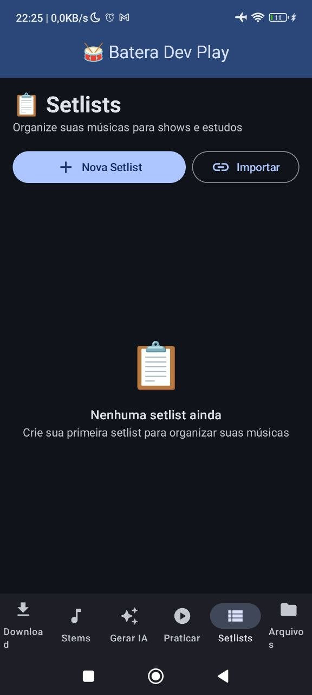
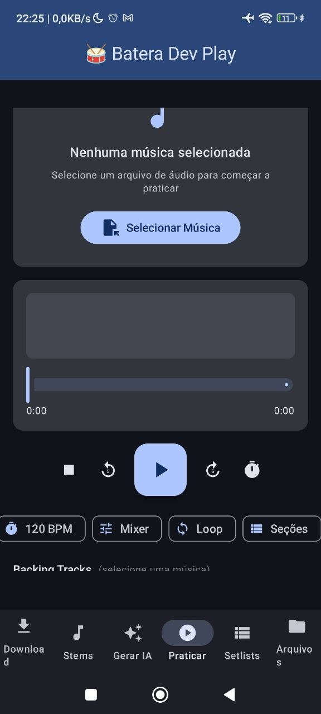
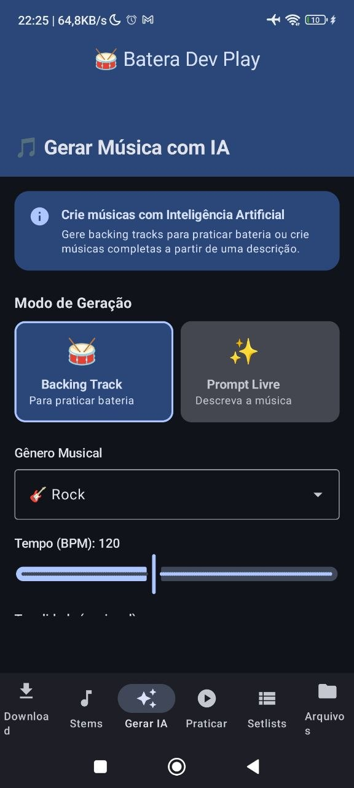
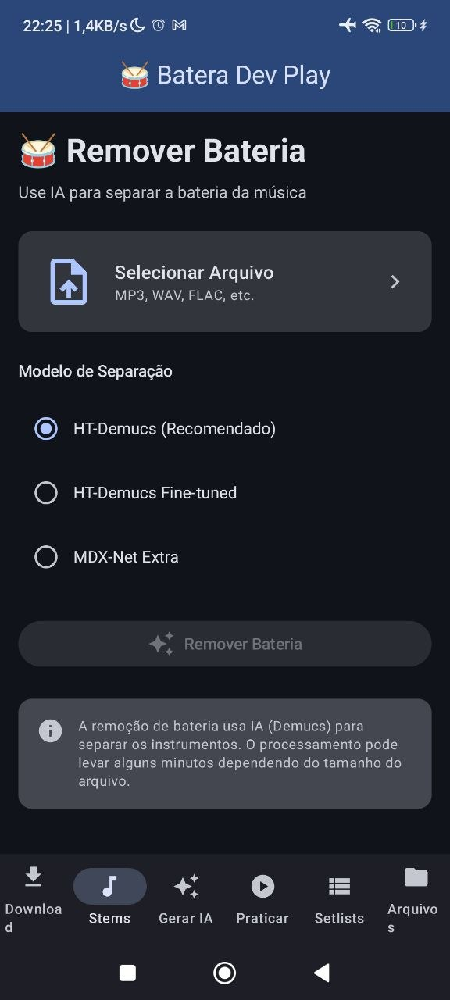
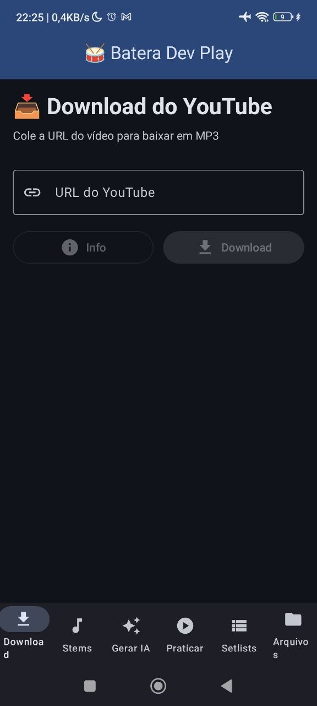

# Batera Dev Play

Batera Dev Play e um app Android para bateristas estudarem, organizarem repertorio e praticarem com apoio de ferramentas de audio. O aplicativo reune download de referencias, separacao de stems, geracao musical assistida por IA, organizacao de setlists, gerenciamento de arquivos e uma tela de pratica pensada para estudo musical.

## Screenshots

<p align="center">
  
  
  
</p>

<p align="center">
  
  
  
</p>

## Recursos

- Download de audio a partir de links para criar material de estudo.
- Separacao de stems para isolar ou remover partes da musica, com foco em bateria.
- Geracao de musica e backing tracks com IA por meio de backend externo.
- Tela de pratica com controles voltados para estudo musical.
- Organizacao de musicas em setlists.
- Gerenciamento de arquivos baixados e processados.
- Analise de audio para apoiar estudo de tempo, estrutura e execucao.

## Como Funciona

O app Android e a interface principal. Algumas funcionalidades, como download, separacao de stems, analise de audio e geracao com IA, dependem de uma API backend configurada separadamente.

O repositorio publico nao inclui o servidor, credenciais, tokens ou configuracoes privadas. A URL do backend deve ser informada no build por meio da propriedade `BACKEND_BASE_URL`.

## Configuracao do Backend

Para rodar no emulador Android usando um backend local na maquina host:

```powershell
.\gradlew assembleDebug -PBACKEND_BASE_URL=http://10.0.2.2:5000
```

Para rodar em um dispositivo fisico, use o endereco do servidor acessivel pela rede:

```powershell
.\gradlew assembleDebug -PBACKEND_BASE_URL=http://SEU_SERVIDOR:5000
```

Tambem existe um arquivo `.env.example` com o nome da variavel esperada:

```env
BACKEND_BASE_URL=http://10.0.2.2:5000
```

## Tecnologias

- Kotlin
- Android Jetpack Compose
- Material 3
- Navigation Compose
- OkHttp
- Retrofit
- Coil
- DataStore
- Media3 ExoPlayer
- Gradle Kotlin DSL

## Estrutura Principal

```text
app/
  src/main/java/com/example/bateradev_play/
    audio/          motores de audio e metronomo
    data/           modelos, repositorios e servicos de API
    services/       servicos Android
    ui/             telas, navegacao, tema e viewmodels
image/              screenshots do app
gradle/             configuracao do wrapper e versoes
```

## Observacao

Este repositorio contem apenas o app Android. O backend deve ser implementado, hospedado e configurado separadamente conforme a necessidade do ambiente.
